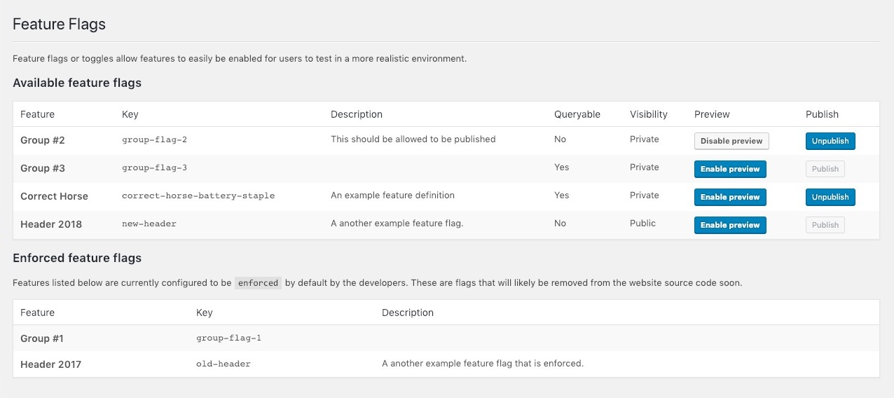

# Feature flags for WordPress themes



This plugin is for developers. The aim is to simplify/speed up the process of working with feature flags. 
This plugin adds an admin interface where users can enable and disable features for testing. Flags can also be enabled 
using query strings.

For planned development work and features see [issues labeled with "enhancement"](https://github.com/jamesrwilliams/feature-flags/issues?q=is%3Aopen+is%3Aissue+label%3Aenhancement).

## Usage

### Required theme changes

Due to the nature of this plugin requiring theme changes, it is a good idea to add the following to the your theme to catch any errors that may occur if the feature-flags plugin is disabled for any reason.

```php
if ( ! function_exists( 'is_enabled' ) ) {
	function is_enabled() {
		return false;
	}
}
```

### Register a flag

```php
register_feature_flag( $args );
```
When registering a flag it is a good idea to wrap them in a function exists block to avoid any errors if the plugin is disabled for any reason. In your templates you can then check the feature status using:

```php
if ( function_exists( 'register_feature_flag' ) ) {

    register_feature_flag([
        
        'title'       => 'My awesome new feature',
        'key'         => 'correct-horse-battery-staple',
        'enforced'    => false,
        'description' => 'An example feature definition'
        'queryable'   => true,
        'private'     => false,
    
    ]);
}
```

Alternatively features can be declared as an nested array to avoid large blocks of feature calls:

```php
register_feature_flag([
    [       
        'title'       => 'Listed Feature #1',
        'key'         => 'listed-feature-1',
    ],
    [       
        'title'       => 'Listed Feature #2',
        'key'         => 'listed-feature-2',
    ] 
]);
```

### Checking the status of a feature flag

```php
is_enabled( 'feature-key' );
```
Replace `feature-key` with the key used in the register function to check if it is enabled.

**Example**

```php
if ( is_enabled( 'correct-horse-battery-staple' ) ) {
    /* Flagged feature */
}
```

### Using Query Strings

You can also enable flags using the query string feature. 
This feature is only enabled if the flag has the `queryable` option enabled in it's declaration.
Once enabled adding a `flag={{key}}` parameter to the URL will enable a flag with that key.

For example:

```php
https://example.com/?flag=correct-horse-battery-staple
```

Flags can be set to private which will require the visitor to be logged in to WordPress to use. Appending the query string to a non-authenticated session will cause the user to be redirected to the login page and then redirected back to their original URL.

## Feature declaration arguments

| Parameter              | Type      | Default | Description |
|------------------------|-----------|---------|---|
| key                    | `string`  | N/A     |  The unique key used in the template to check if a feature is enabled. |
| title                  | `string`  | ""      | The human readable feature name. |
| enforced (optional)    | `boolean` | `false` | Setting this to true will override any user specific settings and will enforce the flag to be true for every user. Useful for deploying a flag before removing it from the codebase. |
| description (optional) | `string`  | ""      | A description displayed in the admin screen. Use to tell users what they are enabling and other information. |
| queryable (optional)   | `boolean` | `false` | Allow users to enable this flag by using a query string in the URL. |
| stable (optional)      | `boolean` | `false` | Allows users to publish features from the admin area. Has to be enabled. Features default to "unstable". |
| private (optional)     | `boolean` | `true`  | Works in tandem with the `queryable` argument. If this is set to false, users are not required to login to enable the flag. |

## Standards

This project uses the [WordPress VIP](https://github.com/Automattic/VIP-Coding-Standards) coding standards.
